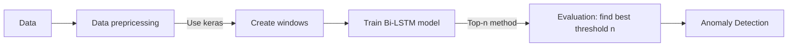

```mermaid
graph LR
   A[Data] --> B[Data prepricessing]

   
   B -- Use keras-->D[Create windows]
   D -->DD[Train Bi-LSTM model]
   DD -- Top-n method -->DDD[Evaluation: find best threshold n]
   DDD --> DDDD[Anomaly Detection]
   
   

``` 

