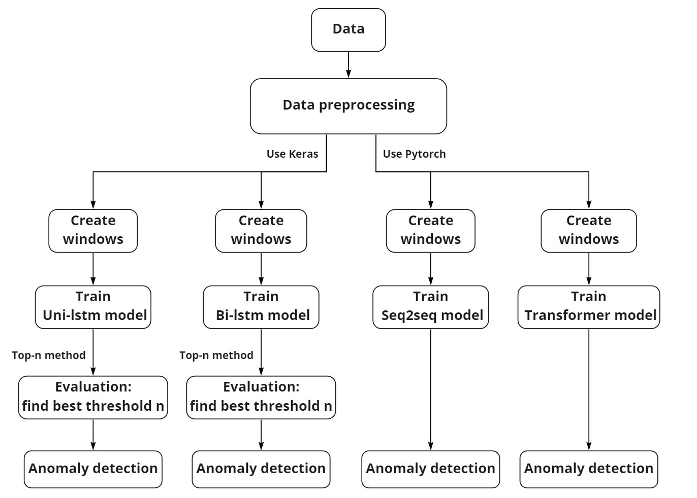

# Master-thesis-project
Sequential Anomaly Detection for Log Data Using Deep Learning

**This is a cooperative project with Volvo GTT and the goal is to do effective anomaly detection for ELT log data, we will not present any company data since it needs to be confidential. However, we used a public dataset (Hadoop Distributed File System) to evaluate our methods which is the part we present here.**

The Hadoop Distributed File System (HDFS) dataset can be found at LogPAI: https://zenodo.org/record/3227177#.YRuMIYgzabg

The idea of the first model is from an article: <https://www.cs.utah.edu/~lifeifei/papers/deeplog.pdf>:

- Unidirecitonal Long short-term Memory (Uni-LSTN)

Next we create an extend version model:

- Bidirectional Long short-term Memory (Bi-LSTM)

However, the above models need a threshold which will plus an necessary extra step. Then we tried: 

- Seq2seq 

and

- Transformer

**Conclusion**

Uniditrctional Long short-term Memory works best for both Volov data and HDFS data.
