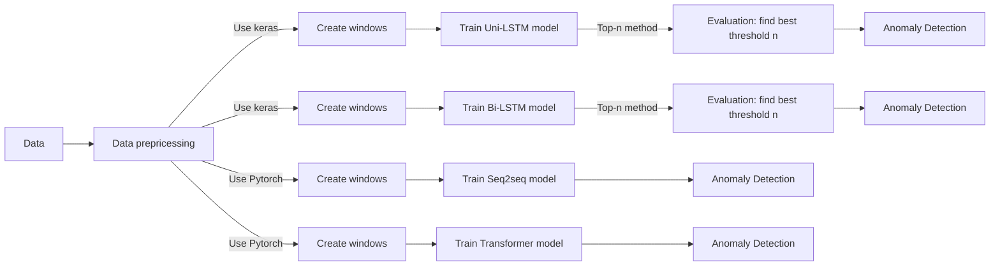

```mermaid
graph LR
   A[Data] --> B[Data prepricessing]
   B -- Use keras -->C[Create windows]
   C -->CC[Train Uni-LSTM model]
   CC -- Top-n method -->CCC[Evaluation: find best threshold n]
   CCC --> CCCC[Anomaly Detection]
   
   
   B -- Use keras-->D[Create windows]
   D -->DD[Train Bi-LSTM model]
   DD -- Top-n method -->DDD[Evaluation: find best threshold n]
   DDD --> DDDD[Anomaly Detection]
   
   
   B -- Use Pytorch -->E[Create windows]
   E -->EE[Train Seq2seq model]
   EE --> EEE[Anomaly Detection]
   B -- Use Pytorch-->F[Create windows]
   F -->FF[Train Transformer model]
   FF --> FFF[Anomaly Detection]
``` 
