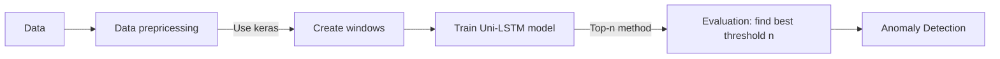

```mermaid
graph LR
   A[Data] --> B[Data prepricessing]
   B -- Use keras -->C[Create windows]
   C -->CC[Train Uni-LSTM model]
   CC -- Top-n method -->CCC[Evaluation: find best threshold n]
   CCC --> CCCC[Anomaly Detection]
``` 
The `Data` is the orinal data which is uncleaned and with both 
